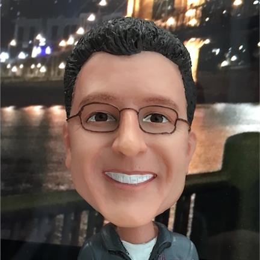

# A Bit About Me
Hey there! I come to Microsoft via an acquisition of my company, ReFirm Labs. I'm now a principal program manager.

## ReFirm Labs
If you're familiar with binwalk, then you already have an idea of what we do. We pinoeered the reverse engineering of Linux-based compiled firmware images. We expanded upon that open source tool to create a SaaS-based enterprise platform to help IoT device makers quickly analyze the security of their firmware before shipping products.

## Tactical Network Soutions
I co-founded TNS in 2007 to offer offensive cyber capabilities to the US military and intelliegnce community. Before ReFirm Labs, we used our expertise in reverse engineering firmware to discover vulnerabiities that could be weaponized for our customers.

## Sample Section
Adding some bogus info so I can practice pull requests.
Trying again 'cause I accidently committed it to the main branch! Oops!! 👎
